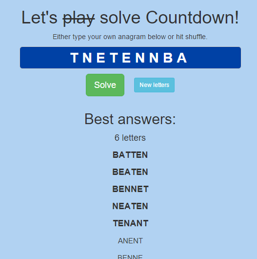

# Countdown
A word game solver bearing no resemblance to the show on Channel 4 whatsoever.

# Getting started
Usual node stuff. Make sure you have `gulp-cli` installed on your command line (`npm install gulp-cli -g`), then you can install using `npm install`.

# Basic usage
## Command line
If you type `node countdown.js`, you get a recurring prompt. Input your anagram, and in true Susie Dent style it will give you the best words.

e.g.
```
> node countdown.js
  ready
  type input to solve (EXIT to exit)
> EMNRITFOS
  [ 'FERMIONS', 'SETIFORM', 'ENSIFORM' ]
  another? type EXIT to exit
> EAUPTDMAD
  [ 'ADAPTED', 'UPDATED' ]
  another? type EXIT to exit
> SODIGESOW
  [ 'GOODIES', 'WOODIES', 'ISODOSE' ]
```

## Web interface
Run the web server using `gulp`. It will default to port 3000. You can then go to [localhost:3000](http://localhost:3000).

The same interface that's live at [countdown.danielthepope.co.uk](http://countdown.danielthepope.co.uk). Hitting that site will generate an anagram for you, or you can add the anagram of your choosing to the URL (e.g. [/tnetennba](http://countdown.danielthepope.co.uk/tnetennba)) and it will generate the results for you.



# Word list
The word list in use is the [Moby word list](http://icon.shef.ac.uk/Moby/mwords.html). It is in the public domain.

`words.txt` is a combination of `113809of.fic` and `4160offi.cia`, the two official crossword files in the Moby collection.

I previously used the list from [Aspell](http://wordlist.aspell.net/dicts/).
